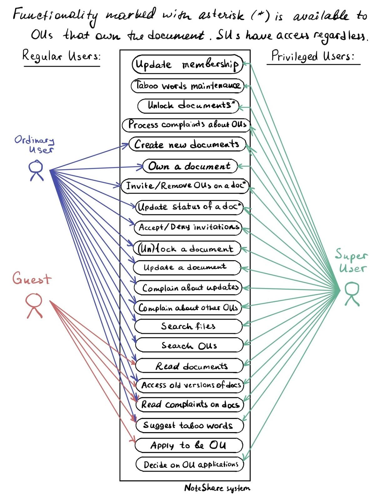
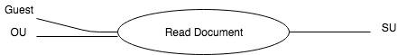
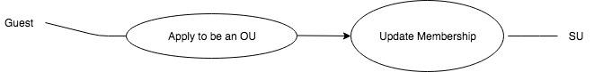
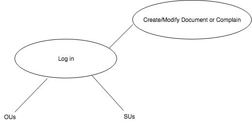
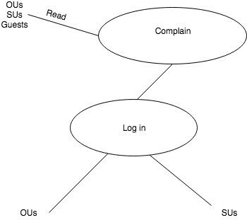

# Software Architecture Document 

## 1. Introduction

### 1.1 Purpose

This  document describes the NoteShare System; it explains the purpose and  features of NoteShare, its interfaces, its reactions to external stimuli  along with design constraints. The document will mainly cover system  software in addition to other technical dependencies.

### 1.2 Scope

NoteShare  will be a note-taking software system designed technical high schools,  colleges, and after school programs. The app enables students to share  study guides and notes related to programming, algorithms and data  structures. 

Essentially,  each class in the school is a separate user group. Each class has a  class president who act as a Super User to moderate the creation of  study guides. Within the class, some students may choose to participate  in using the application, while others do not. Students who participate  by sharing their notes or helping to add to or edit other’s notes have  full access to edit and view the class’ study guides. We call these  students Ordinary Users. However, students who decline to participate  will be Guest Users with more limited access.

This  application could be especially helpful in schools where teachers have  limited time and resources to dedicate to each student. However, the  main purpose of this application is to foster community among  classmates, so they can help one another through school.  

### 1.3 Definitions, Acronyms, and Abbreviations

| Terms                    | Definitions                                                  |
| ------------------------ | ------------------------------------------------------------ |
| SU (Super User)          | A student who administers the system & has full administrative access. |
| OU (Ordinary User)       | A  student who actively participates in creating study guides and has  access to all content, but cannot change account privileges. |
| GU (Guest User or Guest) | A student who does not actively participate and only has limited read and suggestion access. |
| Python                   | Interpreted, object-oriented, dynamic semantics, high-level programming language |
| Database                 | a collection of information that is organized in the system  |
| Taboo Word               | Taboos  are flags that indicate academic mistakes, inappropriate or off-topic  content,  or bullying. These flags get the attention of the SU. |

### 1.4  References

IEEE. IEEE Std 830-1998 IEEE Recommended Practice for Software Requirements Specifications. IEEE Computer Society, 1998.Overview

## 2. Overall Description

### 2.1 Use-Case Model Survey

As  a visual aid, a use-case diagram can help to understand any system.  Below, we have a full use-case diagram that shows the functionalities of  our proposed system. Here, we visualize how users will interact with  NoteShare. We also introduce smaller diagrams where more detail is  needed in section 3.

### 2.2  Assumptions and Dependencies

The  NoteShare interface will be implemented as defined and will not be  altered. It is also assumed that there is enough storage space on the  server for each classes notes as text files. Local copies of notes can  be exported, but are not strictly necessary for a minimum viable  product. Data will therefore be centralized and not divided up between  many users. For many classes, and the server will need to handle  concurrent logins, along with many request in real time.

## 3. Specific Requirements

### 3.1 Use-Case Reports

We have three different users: the Superuser(SU), Ordinary User(OU) and Guest User (GU).

Permissions  granted to each user depends on the user’s type. To differentiate  between users, we use a login system. Each user creates their login  credentials becoming an OU. SU will also have login credentials by  default.

GU  are the most limited users. These are users who are not registered yet  or choose not to regularly participate in the classes note sharing  activities. When Guests access the note sharing system they are only  allowed to read documents, access older version of documents, read  complains, suggest taboo words and apply to be an OU. 

#### Use case 1: Read documents/complains

As  we can see all users are allowed to view and read documents and  complains.  It is not required to be registered in order to do that. 

However,  if the guests want, not only to view the content of file sharing  system, but also to create their own, they have to apply to be OU. 

#### Use case 2: Apply to be OU

After  the user applies to be an OU, his request is granted automatically,  provided the user has notes to share to the class. Otherwise, the SU can  grant access on a case by case basis. Also, if any rules of conduct as  maintained by the school are violated, a user can be banned by SU. 

After  the user successfully registered as an OU, they can all GU actions that  (except apply to be OU) and also own a document, invite orremove OUs on  the document, update status of the document, accept or deny an  invitation, lock or unlock a document, update a document, complain about  updates, complain about other OUs, search files, search OUs. Let’s say  that all of this is included in Create/Modify Document or Complain  section.

#### Use case 3: Create/Modify Documents

Finally,  one user has to maintain and moderate the system. This is what SU are  for. They update membership, address taboos, unlock any locked document  as necessary, and  process complaints about OU's on top of all  privileges reserved for OUs.

#### Use case 4: Complain 

Complains  can be created by OUs and SUs(need to be logged in). However, only SUs  can process them. All users are able to read complains without logging  in. 

### 4.2 Supplementary Requirements

- there is only ONE current version for any document
- for simplicity there is only one word for each line in all documents
- only the editing command(s) are saved for older versions with  three possible actions: add, delete and update. For instance, if the  file doc_1.txt contains one line "the", and doc_2.txt contains three  lines "welcome \n the \n world\n", then your system only saves  doc_2.txt, doc_1.history saves the commands "delete 1; delete 3" which  changes doc_2.txt into doc_1.txt. Your system generates the history  command file based on the difference.
- the retrieval of older versions of documents should be done by  your system based on the current version and possibly a sequence of  history files.
- any  word(s) belonging to the taboo list (maintained by SU) are replaced by  UNK by the system, and the one who use these words are warned  automatically, s/he should update the document next time s/he log in the  system as the first job (all other activities are blocked)
- a creative feature worthy of 15% is required for each system, one  possible feature could be allowing more than word per line, or  speech-based document updating is allowed, or some machine learning  features to render this system adaptable/evolving by itself thru usage.
- a GUI is required, different users should have their own page  populated by his/her picture and 3 most recent documents. For a  brand-new user, the 3 most popular (most read and/or updated) files in  the system are shown.